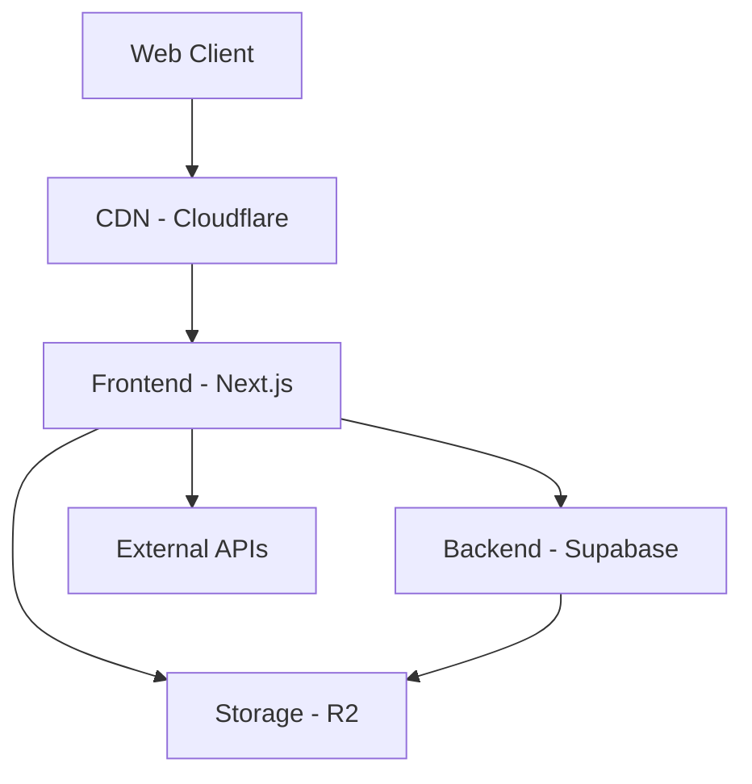
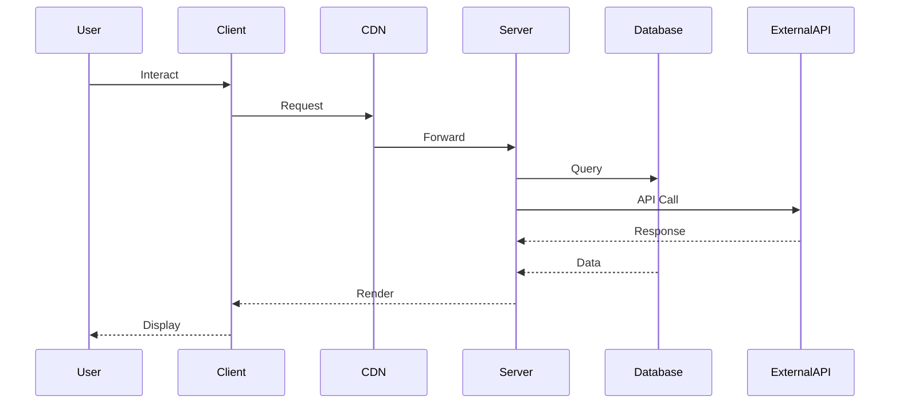

# CliffVibe Architecture Overview

## System Architecture



## Core Components

### Frontend Architecture
```typescript
interface FrontendArchitecture {
  framework: {
    core: 'Next.js 14',
    features: [
      'App Router',
      'Server Components',
      'Server Actions',
      'Streaming SSR'
    ]
  },
  state: {
    local: 'Zustand',
    server: 'React Query'
  },
  styling: {
    core: 'Tailwind CSS',
    components: 'shadcn/ui',
    darkMode: true
  },
  performance: {
    imageOptimization: true,
    routePrefetching: true,
    dynamicImports: true
  }
}
```

### Backend Services (Supabase)
```typescript
interface BackendServices {
  auth: {
    providers: [
      'Email',
      'Google',
      'Apple',
      'Facebook'
    ],
    features: [
      'JWT',
      'Row Level Security',
      'Role-Based Access'
    ]
  },
  database: {
    type: 'PostgreSQL',
    features: [
      'PostGIS',
      'Real-time',
      'Full-text Search'
    ]
  },
  storage: {
    provider: 'R2',
    features: [
      'Image Optimization',
      'Virus Scanning',
      'Access Control'
    ]
  }
}
```

### External APIs
```typescript
interface ExternalServices {
  maps: {
    provider: 'Mapbox',
    features: ['Vector Tiles', 'Geocoding']
  },
  weather: {
    provider: 'OpenWeather',
    features: ['Current', 'Forecast']
  },
  marine: {
    provider: 'EMODnet',
    features: ['Bathymetry', 'Tides']
  }
}
```

## Data Flow

### User Interaction Flow


### Location Data Flow
```typescript
interface LocationDataFlow {
  creation: {
    client: 'Form Submission',
    validation: 'Server-side',
    storage: 'PostgreSQL + R2'
  },
  retrieval: {
    caching: 'Edge Cache',
    realTime: 'Live Weather',
    static: 'Location Details'
  },
  updates: {
    method: 'Real-time Subscriptions',
    trigger: 'Database Changes',
    delivery: 'WebSocket'
  }
}
```

## Security Architecture

### Authentication Flow
```typescript
interface SecurityArchitecture {
  auth: {
    jwt: {
      storage: 'HttpOnly Cookies',
      refresh: 'Silent Token Refresh',
      expiry: '1 hour'
    },
    rls: {
      policies: 'Row Level Security',
      roles: ['anonymous', 'user', 'admin']
    }
  },
  api: {
    rate_limiting: true,
    cors: 'Configured Origins',
    csrf: 'Token Validation'
  }
}
```

## Performance Optimization

### Caching Strategy
```typescript
interface CachingStrategy {
  static: {
    level: 'Edge',
    ttl: '24h',
    invalidation: 'On-demand'
  },
  dynamic: {
    level: 'Server',
    ttl: '5m',
    strategy: 'Stale-while-revalidate'
  },
  api: {
    level: 'Application',
    ttl: 'Varied',
    type: 'React Query'
  }
}
```

## Development Architecture

### Development Environment
```typescript
interface DevEnvironment {
  local: {
    supabase: 'Docker',
    database: 'Local PostgreSQL',
    storage: 'Local Emulator'
  },
  testing: {
    unit: 'Jest',
    integration: 'Testing Library',
    e2e: 'Playwright'
  },
  ci: {
    provider: 'GitHub Actions',
    checks: ['Lint', 'Test', 'Build', 'Type']
  }
}
```

## Deployment Architecture

### Production Setup
```typescript
interface ProductionSetup {
  frontend: {
    hosting: 'Vercel',
    regions: ['eu-central-1', 'eu-west-1']
  },
  backend: {
    hosting: 'Supabase',
    region: 'eu-central-1'
  },
  cdn: {
    provider: 'Cloudflare',
    features: ['R2', 'Edge Functions']
  }
}
```

## Scaling Considerations

### Current Limits
```typescript
interface SystemLimits {
  database: {
    connections: 100,
    storage: '8GB',
    rps: 1000
  },
  storage: {
    size: '100GB',
    files: 1000000,
    upload: '5GB'
  },
  api: {
    rateLimit: '100/min',
    payload: '10MB',
    timeout: '10s'
  }
}
```

### Future Scaling
```typescript
interface ScalingPlan {
  phase1: {
    database: 'Read Replicas',
    cache: 'Redis Cluster',
    cdn: 'Multi-region'
  },
  phase2: {
    compute: 'Edge Functions',
    storage: 'Sharding',
    search: 'Elasticsearch'
  }
}
```

## Next Steps
1. [Frontend Development Guide](../technical/frontend/README.md)
2. [Backend Services Guide](../technical/backend/README.md)
3. [API Documentation](../technical/api/README.md)
4. [Deployment Guide](../deployment/README.md)
